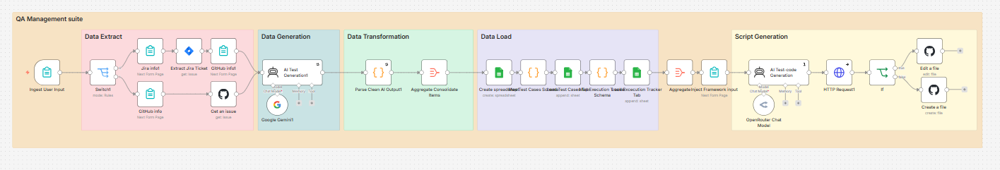

# AI Agent — Automated QA Test Case Generator

An AI agent that autonomously reads a Jira or GitHub issue, reasons over the requirements, generates a complete structured test suite, exports it to Google Sheets, and posts the results as a comment back on the original ticket — all in under a minute.

No manual test case writing. Just submit a ticket ID.

Built with n8n, Google Gemini, and Google Sheets.

### n8n Workflow


---

## What It Does

This is an AI agent — it doesn't just respond to prompts, it acts autonomously:

1. **Ingests** a Jira ticket ID or GitHub issue number from a form submission
2. **Fetches** the issue — summary, description, acceptance criteria (from Jira or GitHub)
3. **Reasons** over the requirements using Google Gemini — detects feature type, infers module, adjusts depth based on priority
4. **Generates** a structured test suite with no human input
5. **Writes** results to Google Sheets — two tabs ready for immediate use
6. **Posts** the test suite as a comment directly on the original Jira ticket or GitHub issue

The agent runs the full pipeline end-to-end. You submit a ticket ID. You get a test suite — and the ticket gets updated automatically.

---

## Pipeline Architecture

```
Ingest          Extract                  Generate           Transform                    Load                        Post Back
──────────────────────────────────────────────────────────────────────────────────────────────────────────────────────────────
User Input  →  Jira or GitHub  →  AI Test Generation  →  Parse + Aggregate + Map  →  Google Sheets  →  Comment on ticket
(Form)         (API)              (Google Gemini)         (Clean + Format)            (2 tabs)           (Jira or GitHub)
```

**Pipeline stages:**
- **Data Extract** — routes to Jira or GitHub based on input, fetches raw ticket/issue data
- **Data Generation** — AI enriches the data into structured test cases via Google Gemini
- **Data Transformation** — cleans, parses, and maps the AI output
- **Data Load** — writes to Google Sheets (Test Cases + Execution Tracker tabs)
- **Post Back** — adds a comment on the original Jira ticket or GitHub issue with the generated test suite

---

## Adaptive Test Generation

The AI adjusts depth and focus based on ticket content:

| Priority | Test Cases Generated |
|---|---|
| High | 20 — extensive edge cases and boundary conditions |
| Medium | 15 — standard coverage |
| Low | 10 — happy path and key negative cases |

Feature type is auto-detected from the ticket:
- **UI** → form validation, navigation, error states, empty states
- **API** → status codes, payloads, authentication, rate limits
- **Mobile** → touch interactions, orientation, offline mode
- **Accessibility** → screen reader, keyboard navigation, contrast

---

## Tech Stack

| Tool | Purpose |
|---|---|
| [n8n](https://n8n.io) | Workflow automation |
| [Google Gemini](https://ai.google.dev) | AI test case generation |
| [Jira Cloud](https://www.atlassian.com/software/jira) | Ticket source (Jira) |
| [GitHub](https://github.com) | Ticket source (GitHub Issues) |
| [Google Sheets](https://sheets.google.com) | Output destination |

---

## Prerequisites

- n8n instance (cloud or self-hosted)
- Jira Cloud account + API token (for Jira input)
- GitHub account + personal access token (for GitHub Issues input)
- Google account with Sheets access (OAuth2)
- Google Gemini API key

---

## Setup

1. **Import the workflow**
   - In n8n, go to Workflows → Import
   - Upload `ai-test-cases-generator.json`

2. **Set up credentials**
   - `Jira SW Cloud` — add your Jira domain, email, and API token
   - `GitHub` — add your personal access token
   - `Google Sheets OAuth2` — connect your Google account
   - `Google Gemini` — add your Gemini API key

3. **Activate the workflow**
   - Click Activate in n8n
   - Open the form URL and submit a Jira ticket ID

---

## Output

Each run creates a new Google Sheet named `{TICKET-ID} Test Cases Report` with:

**Tab 1 — Test Cases**
| Field | Description |
|---|---|
| Test Case ID | TC-{TICKETID}-001 format |
| Title | Action-based test case name |
| Module | Auto-detected from ticket |
| Suite | Smoke / Functional / Regression / Edge Case |
| Preconditions | System and data state required |
| Test Steps | Numbered steps |
| Expected Result | Observable outcome |
| Test Data | Specific inputs needed |
| Test Type | Positive / Negative / Edge Case |
| Priority | High / Medium / Low |
| Status | Not Run |

**Tab 2 — Execution Tracker**
All test case fields plus:
- Run Date
- Actual Result
- Execution Status (Not Run / Pass / Fail / Blocked / Skipped)

---

## Roadmap

- [x] GitHub Issues support
- [ ] Azure DevOps support
- [ ] Linear support
- [ ] TestRail output
- [ ] Observable dashboard — coverage metrics, pass/fail trends, sprint reports
- [ ] Slack notification on completion
- [ ] Multiple ticket processing in one run

---

## Contributing

This project is actively being developed. PRs and suggestions welcome.

If you add support for a new ticket system (Linear, GitHub Issues, Azure DevOps) or a new output (TestRail, Jira Xray), open a PR — it will be merged.

---

## Built By

Sakshi Patil — QA Engineer  
[LinkedIn](https://www.linkedin.com/in/sakshi-patil-50b0b8205/) | [GitHub](https://github.com/sakshiipatiil)
